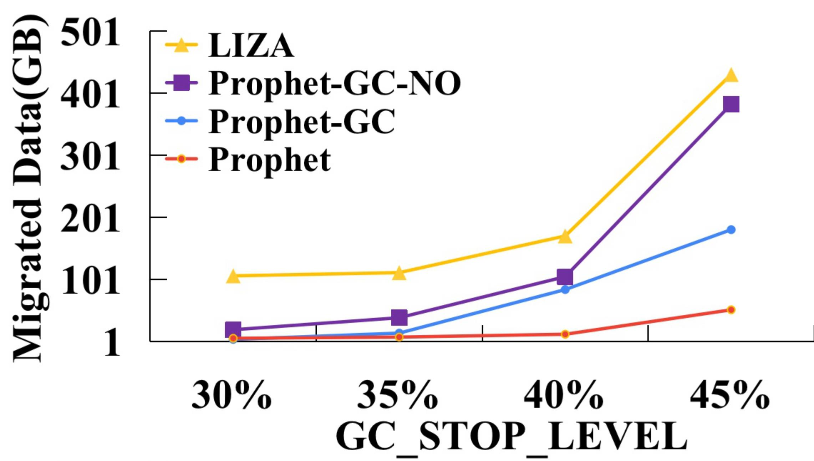
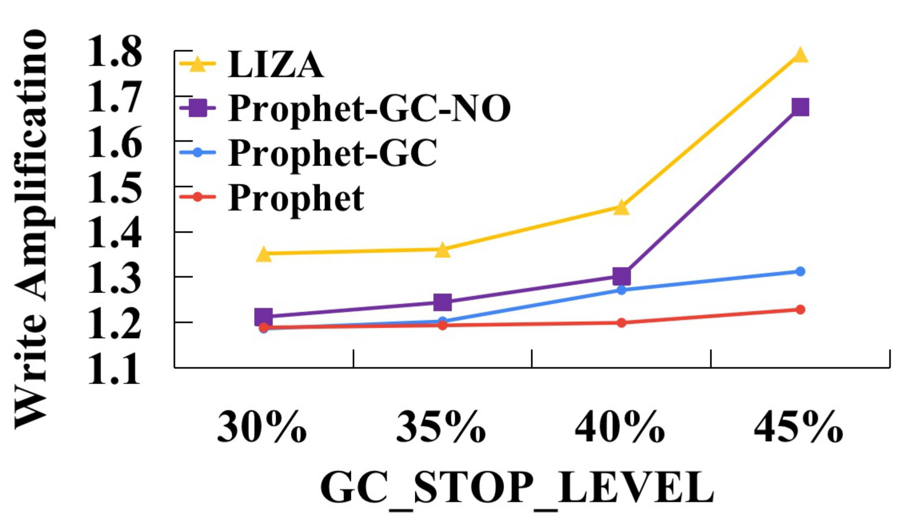
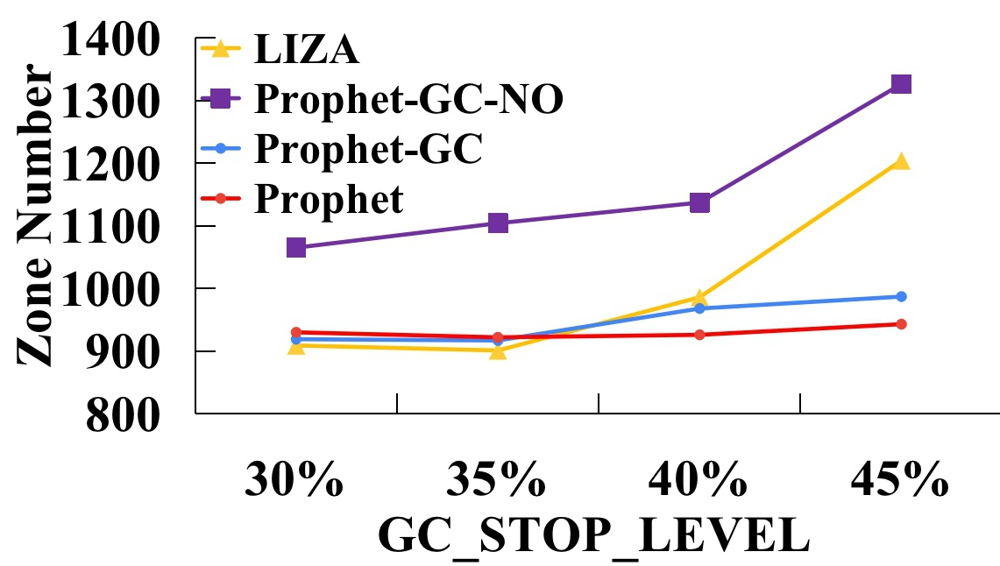

## Prophet

Build Prophet:

Please make sure you have installed the required dependencies in [RocksDB](https://github.com/facebook/rocksdb/blob/main/INSTALL.md) and replace `<zoned block device>` to real ZNS SSD device name.

```bash
sudo git clone https://github.com/asu-idi/prophet-rocksdb.git
cd rocksdb
sudo git clone https://github.com/asu-idi/prophet-zenfs.git
sudo DISABLE_WARNING_AS_ERROR=1 ROCKSDB_PLUGINS=zenfs make -j db_bench install DEBUG_LEVEL=0
pushd .
cd plugin/zenfs/util
sudo make
popd
```

initialize ZNS SSD device

```bash
echo deadline > /sys/class/block/<zoned block device>/queue/scheduler
sudo ./plugin/zenfs/util/zenfs mkfs --zbd=<zoned block device> --aux_path=./temp --force
```

# Benchmark

run db_bench to test(the same config with paper in 64MB SST file size). 

```bash
sudo ./db_bench -num=400000000 -key_size=8 -value_size=256  -statistics=true -max_bytes_for_level_base=268435456  -target_file_size_base=67108864 -write_buffer_size=134217728 writable_file_max_buffer_size=134217728  -max_bytes_for_level_multiplier=4 -max_background_compactions=1 -max_background_flushes=1 -max_background_jobs=1 -soft_pending_compaction_bytes_limit=67108864 -hard_pending_compaction_bytes_limit=67108864 -level0_stop_writes_trigger=12 -level0_slowdown_writes_trigger=8 -level0_file_num_compaction_trigger=4 -max_write_buffer_number=1  -threads=1 -compaction_pri=4 -open_files=1000 -target_file_size_multiplier=1 --fs_uri=zenfs://dev:<zoned block device> --benchmarks='fillrandom,stats' --use_direct_io_for_flush_and_compaction
```

The evaluation result: 


<div style="display: flex; justify-content: space-between;">
    
    
    
</div>